# Top view stitching and tracking (tracking and geometry)

<div>
    
    
    
    
</div>

# Table of contents

-   [Project Overview](#project-overview)
-   [Code Overview](#code-overview)
    - [Top-View Court Stitching](#top-view-court-stitching)
    - [Object Detection on Top-View Images](#object-detection-on-top-view-images)
    - [Object Tracking](#object-tracking)
    - [Ball Detection and Tracking](#ball-detection-and-tracking)
    - [Color-based team identification](#color-based-team-identification)
-   [Project structure](#project-structure)
-   [Getting Started](#getting-started)
-   [Contacts](#contacts)

# Project Overview

This project focuses on processing video footage captured at the Sanbapolis facility in Trento. The main objectives are:

- **Top-View Court Stitching**: The facility has three distinct camera views—top, center, and bottom—each captured by four cameras. Initially, the images from cameras within the same view are stitched together. Then, these stitched views (top, center, and bottom) are merged to create a cohesive top-down view of the entire volleyball court.
- **Object Detection on Top-View Images**: Various object detection algorithms were applied to the stitched top-view images, including frame subtraction, background subtraction, adaptive background subtraction, and Gaussian averaging. After evaluating these methods, background subtraction was selected as the most effective for detecting objects on the court.
- **Object Tracking**: Particle filtering was implemented for tracking detected objects (bounding boxes). Given its performance, no further methods were explored.
- **Ball Detection and Tracking**: YOLO (You Only Look Once) was used for ball detection and tracking. YOLO's efficiency proved to be particularly effective due to the ball's high velocity and potential distortion in certain frames.
- **Color-based Team Identification**: This project processes volleyball videos, and the net was used to separate the two teams. The color-based identification method faces challenges, as players from both teams wear uniforms of similar colors, complicating the identification process.

# Code Overview

## Top-View Court Stitching

In the stitching phase, the images from each view (top, center, bottom) are stitched together. This process involves initially stitching the images from cameras within the same view, followed by combining the views to create a seamless top-down representation of the entire court. Due to the complexity of this task, a filtering algorithm was developed to discard low-quality matches based on the inclination of the line connecting two features.

The final result of the stitching process is shown below:

<p align="center" text-align="center"> 
    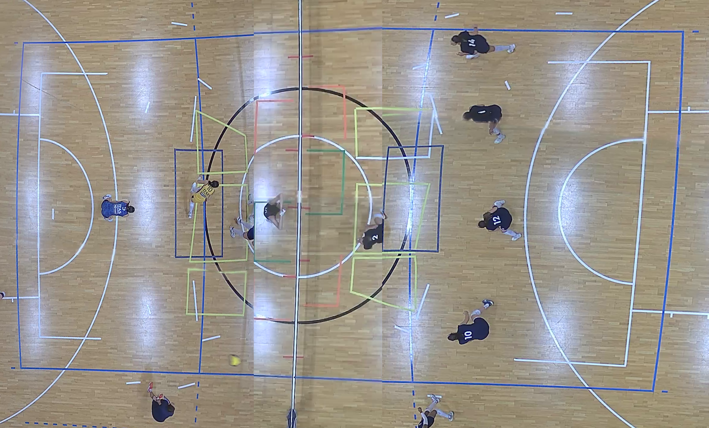 
    <br> 
    <span><i>Stitched image</i></span> 
</p>

One key consideration is that objects positioned higher in the frame are more likely to be cut off at the stitching seams due to the camera angles. For example:

<p align="center" text-align="center"> 
    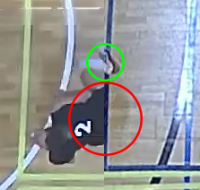 
    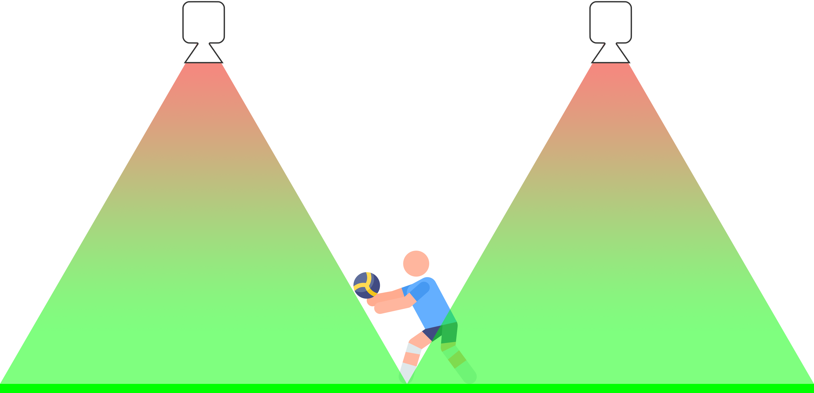 
    <br> 
    <span><i>Example of a player being cut off due to stitching artifacts</i></span> 
</p>

To improve performance, stitching parameters were cached to avoid recalculating them for each iteration.

## Object Detection on Top-View Images

Various object detection algorithms were tested on the stitched top-view images. The methods considered include frame subtraction, background subtraction, adaptive background subtraction, and Gaussian averaging. Background subtraction was found to be the most effective.

The detection process begins with thresholding the image to highlight the most relevant areas, followed by dilation to account for any stitching errors. Small areas are discarded to focus on significant objects:

<p align="center" text-align="center"> 
    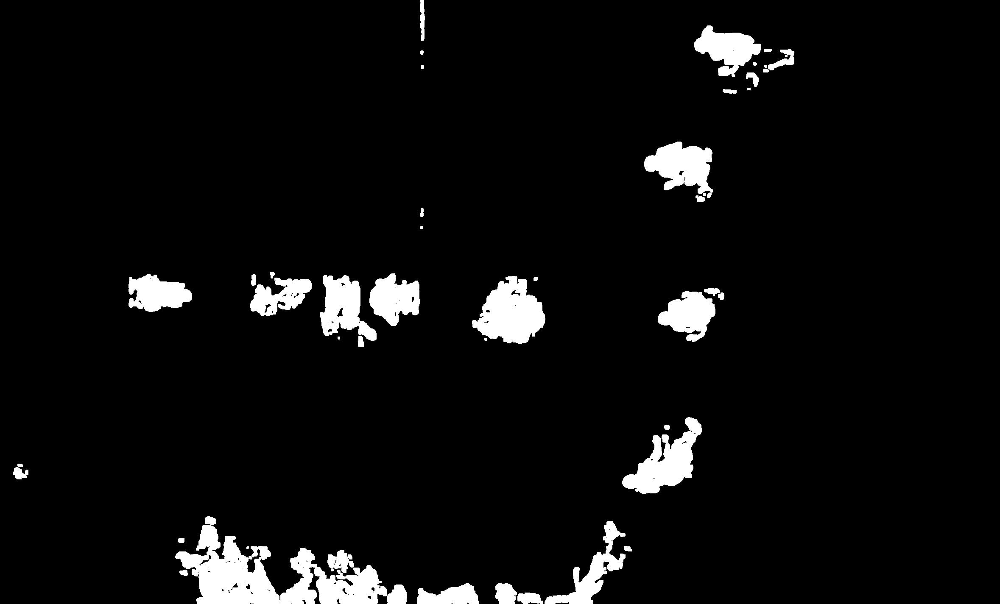 
    <br> 
    <span><i>Thresholded and dilated image</i></span> 
</p>

Next, contours are filtered based on the volleyball court's boundaries, with objects that intersect the court area by 25% or more being retained:

<p align="center" text-align="center"> 
    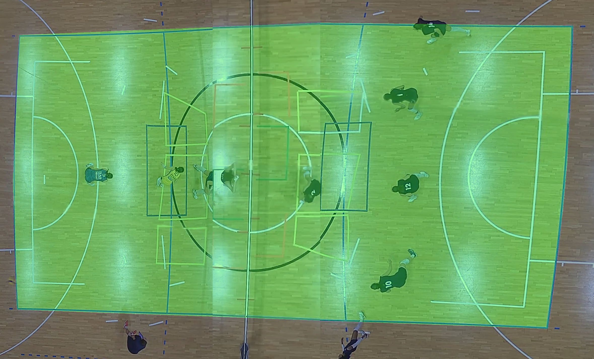 
    <br> 
    <span><i>Volleyball field mask</i></span> 
</p>

Combining these methods results in the following motion detection output:

<p align="center" text-align="center"> 
     
    <br> 
    <span><i>Motion detection</i></span> 
</p>

## Object Tracking

Particle filtering was chosen for object tracking, which initializes a new particle system for each detected bounding box. Over several iterations, the particle system refines its position. Initially, the particles exhibit chaotic behavior:

<p align="center" text-align="center"> 
    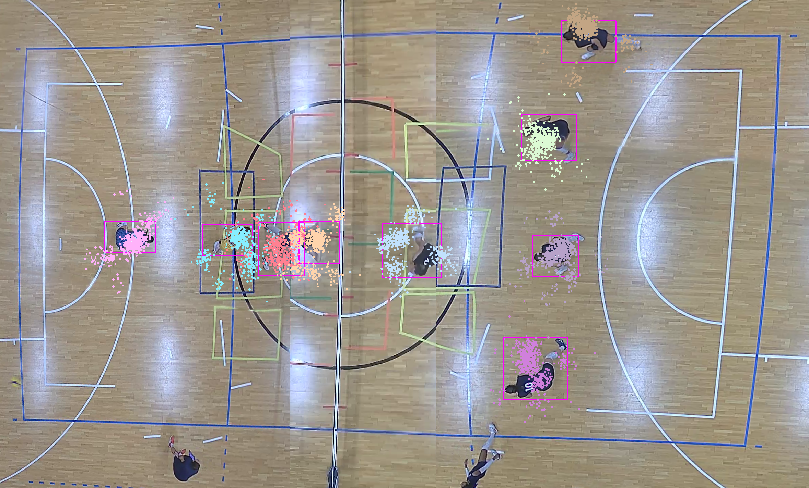 
    <br> 
    <span><i>Initial particle system</i></span> 
</p>

As iterations proceed, the particle system becomes more accurate:

<p align="center" text-align="center"> 
     
    <br> 
    <span><i>Particle system after some iterations</i></span> 
</p>

Finally, the particle system is used to predict the direction of the moving object. While the particle system performs well overall, it struggles with sudden, fast movements, requiring several iterations to adjust:

<p align="center" text-align="center"> 
    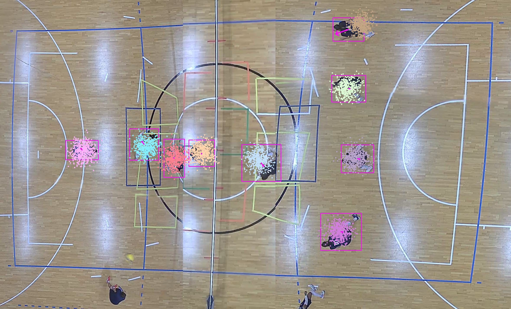 
    <br> 
    <span><i>Motion tracking</i></span> 
</p>

> [!NOTE]
> While particle systems may not be the best option for all tracking scenarios, they performed well for this project. Other methods might be more appropriate for rapid changes in object movement.

## Ball Detection and Tracking

For ball detection and tracking, YOLO (You Only Look Once) was used. Given the high velocity of the ball, traditional methods often resulted in distortion, making it difficult to detect. To overcome this, a custom dataset was created by manually extracting 1,000 images from the video, each with a labeled bounding box around the ball.

YOLO v11 was then applied to the dataset, enabling accurate detection. The same particle system technique used for player tracking was applied to track the ball's movement:

<p align="center" text-align="center">
  
  <br>
  <span><i>Ball detection and tracking</i></span>
</p>

As with player tracking, the particle system may require a few iterations to adapt to rapid movements, potentially leading to inaccurate predictions during those iterations.

> [!NOTE]
> Although particle systems can face challenges in tracking fast-moving objects, the ball's movement is more predictable, making the technique more effective in this case.

## Color-based Team Identification

Given that this project processes volleyball videos, the optimal method for team identification was to use the net to separate the two teams. This approach is particularly effective since players from different teams in volleyball are generally positioned on opposite sides of the net.

However, color-based team identification faced challenges due to the similarity in uniform colors between the two teams.

<p align="center" text-align="center">
  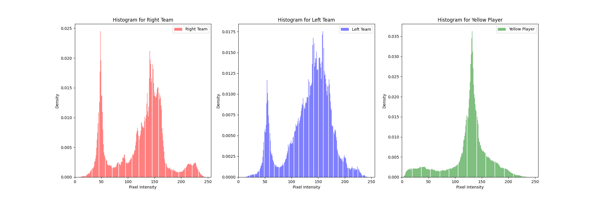
  <br>
  <span><i>Color-based team identification applied to distinct colors</i></span>
</p>

As shown in the histograms, the uniform colors of the two teams were highly similar, making it difficult to distinguish between them based solely on color. However, if the uniforms differed more significantly, color-based identification would be much more effective.

While this method is fast and efficient, it has some limitations. For instance, when players from both teams are near the net, they may be merged into a single bounding box, leading to misclassification of one team. Using YOLO for more precise detection could mitigate this issue.

<p align="center" text-align="center">
  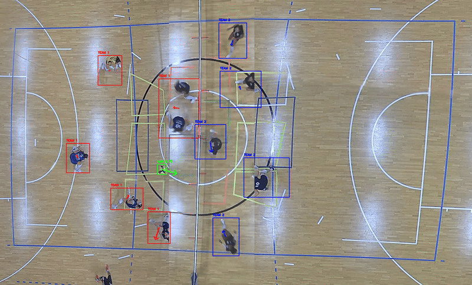
  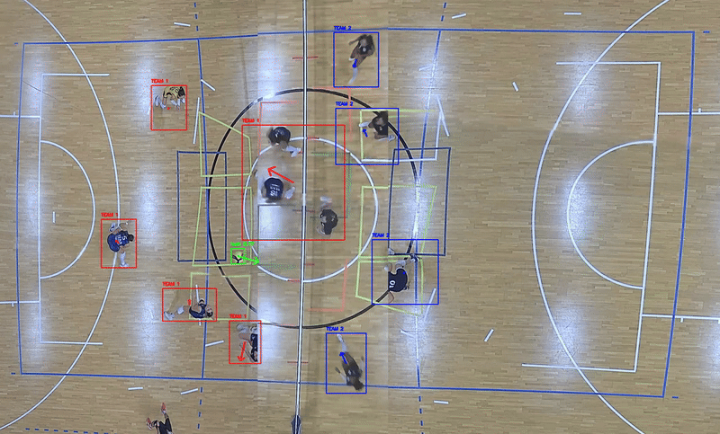
  <br>
  <span><i>Two bounding boxes near the net merged into a single bounding box, resulting in misclassification</i></span>
</p>


# Project structure

```text
.
├── assets          # Images
├── models          # YOLO11 model
├── libs            # Source files
└── videos
    ├── cut         # Cut videos (private)
    ├── original    # Original videos (private)
    └── processed   # Processed videos (private)
```

# Getting Started

1. Set up the workspace:

    ```bash
    git clone https://github.com/christiansassi/computer-vision-project
    cd computer-vision-project
    pip install -r requirements.txt
    ```

2. Run [main.py](main.py) script:

    ```bash
    python3 main.py
    python3 main.py -live # Run in live mode
    ```

> [!WARNING]
> Due to privacy reasons, the video files cannot be shared.

<p align="center" text-align="center">
  
  <br>
  <span><i>Demo</i></span>
</p>

<p align="center" text-align="center">
  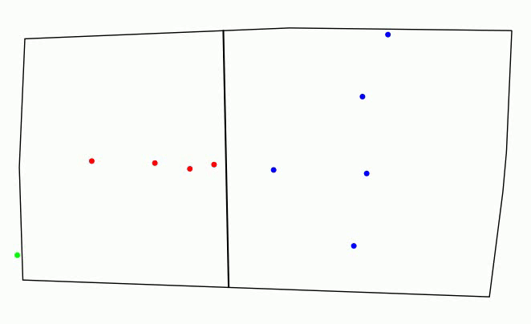
  <br>
  <span><i>Tracking plot</i></span>
</p>

# Contacts

Pietro Bologna - [pietro.bologna@studenti.unitn.it](mailto:pietro.bologna@studenti.unitn.it)

Christian Sassi - [christian.sassi@studenti.unitn.it](mailto:christian.sassi@studenti.unitn.it)

<picture>
    <source media="(prefers-color-scheme: dark)" srcset="assets/extras/dark.png">
    
</picture>
