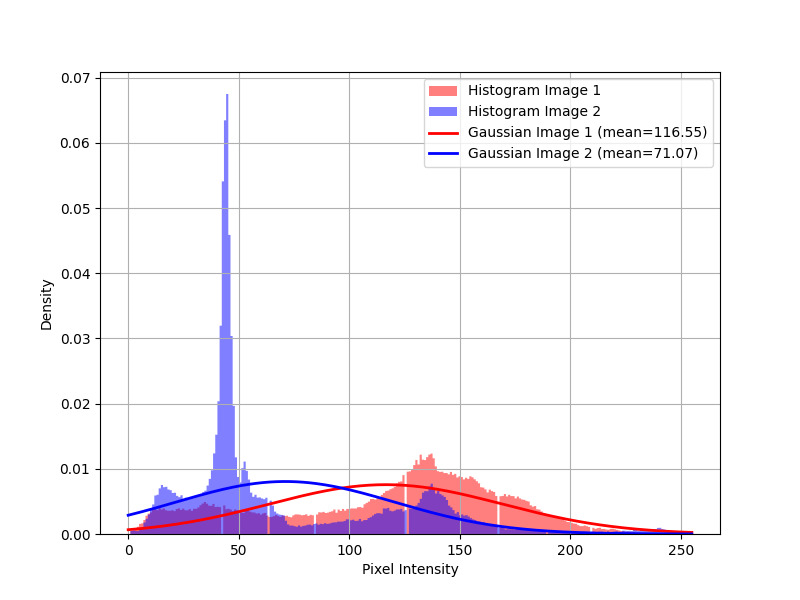
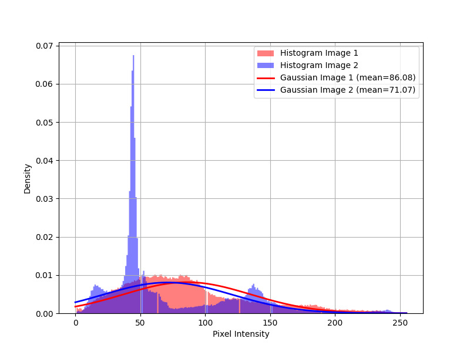

# Top view stitching and tracking (tracking and geometry)

<div>
    
    
    
    
</div>

# Table of contents

-   [Project Overview](#project-overview)
-   [Code Overview](#code-overview)
    - [Top-View Court Stitching](#top-view-court-stitching)
    - [Object Detection on Top-View Images](#object-detection-on-top-view-images)
    - [Object Tracking](#object-tracking)
    - [Ball Detection and Tracking](#ball-detection-and-tracking)
    - [Color-based team identification](#color-based-team-identification)
-   [Project structure](#project-structure)
-   [Getting Started](#getting-started)
-   [Contacts](#contacts)

# Project Overview
This project focuses on processing video camera images from the Sanbapolis facility in Trento. The objectives are:

- **Top-View Court Stitching**: The facility consists of three distinct views—top, center, and bottom—each captured by four cameras. The process begins by stitching the images from cameras within the same view. Once each view is reconstructed, the next step involves stitching the top, center, and bottom views together to create a seamless top-view of the entire court.
- **Object Detection on Top-View Images**: Several detection algorithms were applied to the stitched top-view images, testing various techniques, including frame subtraction, background subtraction, adaptive background subtraction, and Gaussian averaging. After evaluation, background subtraction was identified as the most effective method for this task.
- **Object Tracking**: Particle filtering was implemented for tracking detected objects (bounding boxes). Given its performance, no further methods were explored.
- **Ball Detection and Tracking**: The YOLO (You Only Look Once) algorithm was used for ball detection and tracking, demonstrating suitability for this task.
- **Color-based team identification**: As this project is designed for processing volleyball videos, the optimal approach is to use the net to separate the two teams.

# Code Overview

## Top-View Court Stitching

In the stitching phase, the process began by stitching images captured from the same views, where each view is associated with four cameras. This initial step is relatively straightforward.

Subsequently, the stitched images from the three views were combined. Due to the complexity of this task, a filtering algorithm was developed to discard incorrect or low-quality matches between images from different views (top-center, bottom-center, and top-center with bottom-center). The algorithm evaluates the inclination of the line connecting two features, discarding pairs where the inclination is too high. To enhance robustness, some feature pairs were manually selected to ensure better quality matches. The final result is shown below:

<p align="center" text-align="center"> 
     
    <br> 
    <span><i>Stitched image</i></span> 
</p>

It is important to consider that due to the camera view angles, objects positioned higher in the frame are more likely to be "cut" at the stitching seams. 

<p align="center" text-align="center"> 
     
     
    <br> 
    <span><i>Example of a player being cut off due to stitching artifacts</i></span> 
</p>

In the image, the green circle shows that the feet align correctly across the stitching sections. However, the red circle highlights a misalignment in the upper body of the player, which occurs due to the view angle effect mentioned earlier.

Finally, to improve performance, stitching parameters were cached to avoid recalculating them for each operation.

## Object Detection on Top-View Images
Several detection algorithms were applied to the stitched top-view images, testing various techniques from coursework, including frame subtraction, background subtraction, adaptive background subtraction, and Gaussian averaging. After evaluation, background subtraction was selected as the most effective method.

The first step involves applying a threshold to the image to extract the most relevant areas. During this phase, dilation is applied to account for stitching errors that sometimes cause players to be incorrectly displayed as separate objects. The dilation helps merge these separated segments into a single object. Additionally, small areas are discarded:

<p align="center" text-align="center"> 
     
    <br> 
    <span><i>Thresholded and dilated image</i></span> 
</p>

Next, contours are filtered based on the volleyball court area. The court's boundaries are defined, and objects that intercept this area by 25% or more are retained. This approach helps discard irrelevant objects, such as people outside the court (e.g., coaches) who may briefly step into the frame:

<p align="center" text-align="center"> 
     
    <br> 
    <span><i>Volleyball field mask</i></span> 
</p>

By combining these two techniques, the following result was achieved:

<p align="center" text-align="center"> 
     
    <br> 
    <span><i>Motion detection</i></span> 
</p>

However, it is important to note that this methodology can sometimes merge nearby bounding boxes into a single box, especially when players interact or are in close proximity to each other.

## Object Tracking

For tracking detected objects (bounding boxes), particle filtering was implemented, a technique studied during the course. As this method performed well, further exploration of additional techniques was deemed unnecessary.

For each detected bounding box, a new particle system was initialized. Initially, the particles in each system exhibited chaotic behavior due to the randomness at the start:

<p align="center" text-align="center"> 
     
    <br> 
    <span><i>Initial particle system</i></span> 
</p>

At each iteration, the particle systems were compared with the updated bounding boxes to determine if a particle system still had an associated bounding box (i.e., the object is still detected) or if a new system was required (i.e., the object is no longer detected, or a new object has appeared).

To associate a particle system with its corresponding bounding box, the distance between the centroid of the particle system and the bounding box was evaluated. A particle system was associated with a bounding box if it had the smallest distance to that bounding box. Otherwise, if no suitable particle system was found, a new one was created.

Through repeated iterations, the randomness within each particle system diminished:

<p align="center" text-align="center"> 
     
    <br> 
    <span><i>Particle system after some iterations</i></span> 
</p>

Finally, the particle systems were used to predict the possible direction of a moving object. It is important to note that for small movements, the direction arrow may appear slow and less certain. Additionally, if an object makes a sudden, fast movement, the particle system may require a few iterations to adapt, potentially resulting in incorrect predictions during those iterations.

<p align="center" text-align="center"> 
     
    <br> 
    <span><i>Motion tracking</i></span> 
</p>

> [!NOTE]
> It is important to highlight that, generally speaking, a particle system may not be the best option for these scenarios due to its difficulty in adapting to rapid changes. However, it is effective in this case, but it should be noted that other methods may be more suitable for our specific requirements.

## Ball Detection and Tracking

For ball detection and tracking, the YOLO (You Only Look Once) algorithm was employed, as it proved well-suited for this task. Due to the ball’s high velocity, it often appeared distorted in some frames, making it difficult to detect using traditional techniques.

The first step involved creating a dataset specifically for this task. Approximately 1,000 images were manually extracted from the videos, focusing on selecting the ball. YOLO v11 was then applied to this dataset, enabling accurate ball detection. Finally, the same technique used for tracking the players was applied here, producing the following result:

<p align="center" text-align="center">
  
  <br>
  <span><i>Ball detection and tracking</i></span>
</p>

As with player tracking, if the ball makes a sudden, rapid movement, the particle system may require a few iterations to adjust. This can result in inaccurate predictions during those iterations, as shown in the video above.

> [!NOTE]
> Even for this application, tracking based on a particle system can be challenging. However, in this case, unlike with players, the difficulties encountered by the tracking system may be less pronounced because the ball has a more predictable movement.

## Color-based team identification

For this purpose, the optimal approach was to use the net to separate the two teams, as this project is designed to process volleyball videos rather than videos of other sports where players from different teams may intermingle.

This decision was further justified by the fact that in the provided videos, players from both teams wear uniforms of similar colors, making color-based team identification challenging.

<p align="center" text-align="center">
  
  
  <br>
  <span><i>Color-based team identification applied to distinct colors</i></span>
</p>

The first image illustrates the high similarity between the Gaussian distributions of the colors worn by players from the two different teams. In contrast, the second graph demonstrates how color-based team identification could be effective if the colors were sufficiently distinct. This plot references the blue color of one team and the yellow color of a player to show that while this method can be applicable, it is not suitable in the current scenario.

However, it is important to note that this methodology has its pros and cons. Pros include its speed, ease of separating players, and consistent performance. Cons arise from the detection method used (which does not employ YOLO). When players from different teams are positioned near the net, they may be merged into a single bounding box, leading to the misclassification of one of the teams. If YOLO were used, this issue could likely be mitigated.

<p align="center" text-align="center">
  
  
  <br>
  <span><i>Two bounding boxes near the net merged into a single bounding box, resulting in the misclassification of one of the two teams</i></span>
</p>

# Project structure

```text
.
├── assets          # Images
├── models          # YOLO11 model
├── src             # Source files
└── videos
    ├── cut         # Cut videos (private)
    ├── original    # Original videos (private)
    └── processed   # Processed videos (private)
```

# Getting Started

1. Set up the workspace:

    ```bash
    git clone https://github.com/christiansassi/computer-vision-project
    cd computer-vision-project
    pip install -r requirements.txt
    ```

2. Run [main.py](main.py) script:

    ```bash
    python3 main.py
    ```

> [!WARNING]
> Due to privacy reasons, the video files cannot be shared.

<p align="center" text-align="center">
  
  <br>
  <span><i>Demo</i></span>
</p>

<p align="center" text-align="center">
  
  <br>
  <span><i>Tracking plot</i></span>
</p>

# Contacts

Pietro Bologna - [pietro.bologna@studenti.unitn.it](mailto:pietro.bologna@studenti.unitn.it)

Christian Sassi - [christian.sassi@studenti.unitn.it](mailto:christian.sassi@studenti.unitn.it)

<picture>
    <source media="(prefers-color-scheme: dark)" srcset="assets/extras/dark.png">
    
</picture>
